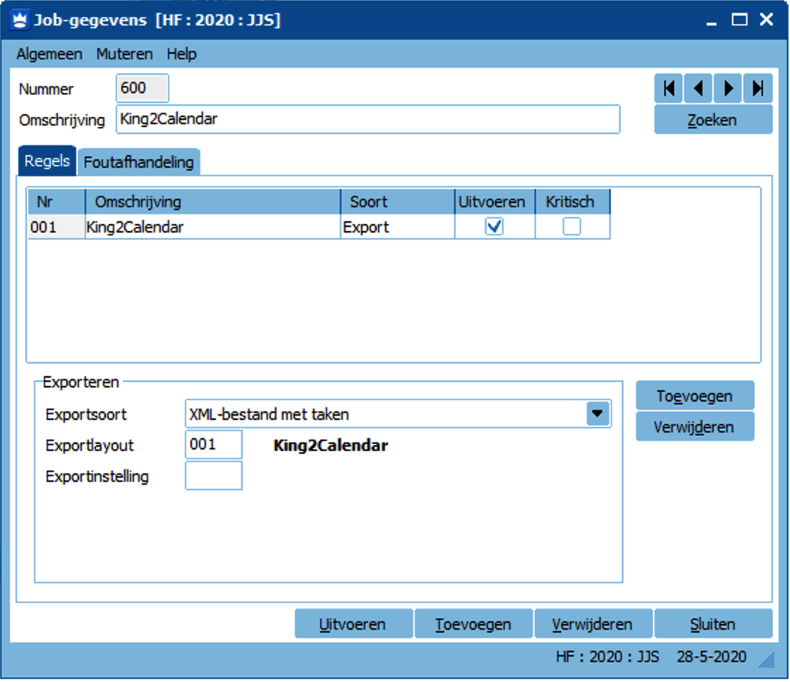

# King2Calendar

Converteer King Taken naar Calendar formaat (ics) om te gebruiken in Outlook, Google Calendar, Apple Calendar, etc.

### Config bestand
De configuratie van variabelen staat in het `.env` bestand.

### Toevoegen Job in King
Voeg een Job in King toe om taken te exporteren. Gebruik het Job nummer (in dit voorbeeld 600) in `.env`

Gebruik de bestandsnaam in de export-layout in voor `export_bestand` in `.env`

